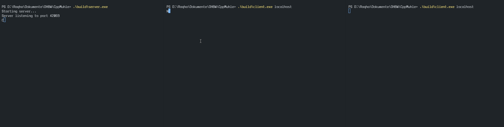
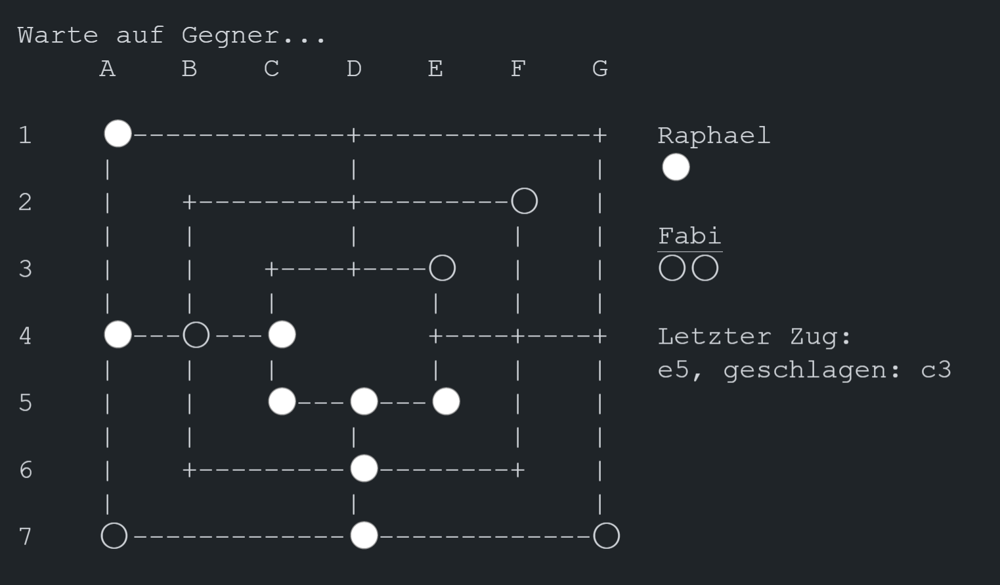

# CppMuhle

C++ Projekt für eine Netzwerkangebundene Implementierung des Brettspielklassikers Mühle.\
Es existiert eine ältere Koop-Variante des Spiels ohne Netzwerkanbindung im [Release CppMühle v1.0](https://github.com/DHBW-Inf20/CppMuhle/releases/tag/CppMuhle-1.0)

 [➤ Usage](https://github.com/DHBW-Inf20/CppMuhle#user-content-usage)\
 [➤ Dependencies](https://github.com/DHBW-Inf20/CppMuhle#user-content-dependencies)\
 [➤ Building](https://github.com/DHBW-Inf20/CppMuhle#user-content-building)\
 [➤ Demo](https://github.com/DHBW-Inf20/CppMuhle#user-content-demo)

## Umgesetzte Anforderungen

### Must Have

- [x] Spielbrett auf der Konsole ausgeben
- [x] Grundlegende Spiellogik implementieren
- [x] Spielbrett anhand der Spiellogik aktualisieren

### Should Have

- [x] Eine schönere GUI in der Konsole mit Menü

### Nice to Have

- [x] Multiplayer übers Netzwerk implementieren

## Projektteilnehmer

- [Fabian Klimpel](https://github.com/FabiKl)
- [Jan Perthel](https://github.com/jan510)
- [Raphael Sack](https://github.com/Raqhael)

## Usage

```plain
Server:
    server <port=42069>

        Führt einen Server aus, der die Logik des Spiels hält.
        Der Server hört auf Port 42069 zu.

Client:
    client <ip=localhost> <port=42069>

    Führt einen Client aus, welcher mit dem Server kommuniziert. 
    Falls keine Parameter mitgegeben werden, versucht er auf localhost:42069 zu senden.
```

Nachdem erfolgreich eine Verbindung zu einem Server hergestellt wurde, wird der Nutzer nach einem Namen gefragt (Dieser hat einen rein kosmetischen UI Nutzen). Im darauffolgendem Hauptmenü lässt sich nun ein neues Spiel erstellen, oder beitreten.

Wenn ein neues Spiel erstellt wird, bekommt der Spieler einen 4 stelligen Spiel-Code angezeigt den er seinem Freund (Oder einem anderen Terminal-Insantz) weiterleiten kann. Dieser Code kann in dem Menüpunkt "Einem Spiel beitreten" eingegeben werden. (Vorraussetzung natürlich, sie sind auf dem selben Server verbunden).

## Dependencies

- GCC 4.8.1+
- C++ Boost Library (Entwickelt mit Version 1_78)

## Building

Um das Projekt zu builden, muss lediglich die makefile ausgeführt werden.
Falls der standartcompiler (g++) nicht gefunden wird, kann dieser mit dem parameter `CXX` angegeben werden.
Falls der Include-Path und Library-Path zu Boost nicht standartmäßig vom Compiler gefunden werden, können diese Pfade mit den Parametern `libraryPath` und `includePath` dem build mitzugefügt werden

```bash
make [includePath=$BOOSTINCLUDE libraryPath=$BOOSTLIBRARY]
```

Die binarys befinden sich im Ordner ./build

### Troubleshooting

Falls die makefile nicht funktionieren sollte, lassen sich die Binarys auch jeweils mit folgenden Commands builden:

```shell
g++ -std=c++11 -o build/server source/network/packet_factory.cpp source/network/net_server.cpp source/server/network_controller.cpp source/logic/muhle_logik.cpp source/server/game_controller.cpp source/server/main_server.cpp -lboost_system -lboost_thread -lpthread

g++ -std=c++11 -o build/client source/client/konsolen_view.cpp source/network/packet_factory.cpp source/network/net_client.cpp source/client/client_controller.cpp source/client/main_client.cpp -lboost_system -lboost_thread -lpthread
```

Falls die Boost-Library-Pfade nicht standardmäßig in gcc hinterlegt sind, können diese mit der angabe des `-I` und `-L` Parameter ergänzt werden (`-I <Path-to-Boost-header> -L <Path-to-Boost-Libraries>`).

**Falls das Projekt unter Windows gebuildet wird, müssen noch zusätzlich die Libraries `-lwsock32 -lws2_32` mit verlinkt werden (jeweils am Ende des commands anhängen)**

## Anleitung

1. Die Züge werden wie in Schach über eine Notation gelöst. Das Mühle-Feld lässt sich aufteilen in a-g Spalten und 1-7 Zeilen.
2. Die Auswahl des Feldes erfolgt über die Angabe der Notation (z. B. `a7`).
3. Das Spiel läuft wie folgt ab:
    - Setzphase: Die Spieler setzen abwechselnd je einen Stein, insgesamt je neun, auf Kreuzungs- oder Eckpunkte des Brettes
    - Zugphase: Die Spielsteine werden gezogen, das heißt, pro Runde darf jeder Spieler einen Stein auf einen angrenzenden, freien Punkt bewegen. Kann ein Spieler keinen Stein bewegen, hat er verloren.
    - Endphase: Sobald ein Spieler nur noch drei Steine hat, darf er mit seinen Steinen springen, das heißt, er darf nun pro Runde mit einem Stein an einen beliebigen freien Punkt springen. Sobald ihm ein weiterer Stein abgenommen wird, hat er das Spiel verloren.

Drei Steine einer Farbe, die in einer Geraden auf Feldern nebeneinander liegen, nennt man eine „Mühle“. Wenn ein Spieler eine Mühle schließt, darf er einen beliebigen Stein des Gegners aus dem Spiel nehmen, sofern dieser Stein nicht ebenfalls Bestandteil einer Mühle ist.

## Demo




## Projekt-Struktur

```bash
├───source 
    ├───client <-- Code für die Konsolen-Ausgabe und die Verbindung zum Server
    ├───exceptions 
    ├───logic <-- Code für die Implementierung von Mühle + misc.
    ├───network <-- Alles zum Thema Networking
    │   └───packets
    └───server <-- Code für das Handling der Client-Anfragen / Interface zwischen Spieler und Spiel
```
