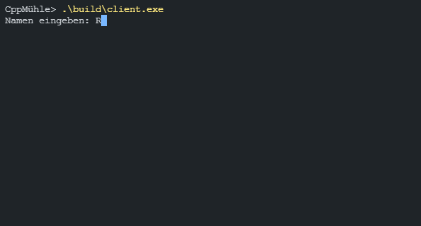

# CppMuhle

C++ Projekt für die implementation des Brettspiel Mühle auf der Konsole

## Umgesetzte Anforderungen

### Must Have

- [x] Spielbrett auf der Konsole ausgeben
- [x] Grundlegende Spiellogik implementieren
- [x] Spielbrett anhand der Spiellogik aktualisieren

### Should Have

- [x] Eine schönere GUI in der Konsole mit Menü

### Nice to Have

- [x] Multiplayer übers Netzwerk implementieren

## Projektteilnehmer

- [Fabian Klimpel](https://github.com/FabiKl) (@FabiKl)
- [Jan Perthel](https://github.com/jan510) (@jan510)
- [Raphael Sack](https://github.com/Raqhael) (@Raqhael)

## Usage

```plain
Server:
    server <port=42069>

        Führt einen Server aus, der die Logik des Spiels hält.
        Falls kein Parameter mitgegeben wird, wird der Server auf Port 42069 hören.

Client:
    client <ip=localhost> <port=42069>

    Führt einen Client aus, welcher mit dem Server kommuniziert. 
    Falls keine Parameter mitgegeben werden, versucht er auf localhost:42069 zu senden.
```

## Dependencies

- GCC 4.8.1+
- C++ Boost Library (Entwickelt mit Version 1_78)

## Building

Um das Projekt zu builden, muss lediglich die makefile ausgeführt werden.
Falls der standartcompiler (g++) nicht gefunden wird, kann dieser mit dem parameter `CXX` angegeben werden.
Falls der Include-Path und Library-Path zu Boost nicht standartmäßig vom Compiler gefunden werden, können diese Pfade mit den Parametern `libraryPath` und `includePath` dem build mitzugefügt werden

```bash
make includePath=$BOOSTINCLUDE libraryPath=$BOOSTLIBRARY
```

Die binarys befinden sich im Ordner ./build

## Anleitung

1. Die Züge werden wie in Schach über eine Notation gelöst. Das Mühle-Feld lässt sich aufteilen in a-g Spalten und 1-7 Zeilen.
2. Die Auswahl des Feldes erfolgt über die Angabe der Notation (z. B. `a7`).
3. Das Spiel läuft wie folgt ab:
    - Setzphase: Die Spieler setzen abwechselnd je einen Stein, insgesamt je neun, auf Kreuzungs- oder Eckpunkte des Brettes
    - Zugphase: Die Spielsteine werden gezogen, das heißt, pro Runde darf jeder Spieler einen Stein auf einen angrenzenden, freien Punkt bewegen. Kann ein Spieler keinen Stein bewegen, hat er verloren.
    - Endphase: Sobald ein Spieler nur noch drei Steine hat, darf er mit seinen Steinen springen, das heißt, er darf nun pro Runde mit einem Stein an einen beliebigen freien Punkt springen. Sobald ihm ein weiterer Stein abgenommen wird, hat er das Spiel verloren.

Drei Steine einer Farbe, die in einer Geraden auf Feldern nebeneinander liegen, nennt man eine „Mühle“. Wenn ein Spieler eine Mühle schließt, darf er einen beliebigen Stein des Gegners aus dem Spiel nehmen, sofern dieser Stein nicht ebenfalls Bestandteil einer Mühle ist.

## Demo



## Projekt-Struktur

```bash
├───source 
    ├───client <-- Code für die Konsolen-Ausgabe und die Verbindung zum Server
    ├───exceptions 
    ├───logic <-- Code für die Implementierung von Mühle + misc.
    ├───network <-- Alles zum Thema Networking
    │   └───packets
    └───server <-- Code für das Handling der Client-Anfragen / Interface zwischen Spieler und Spiel
```
